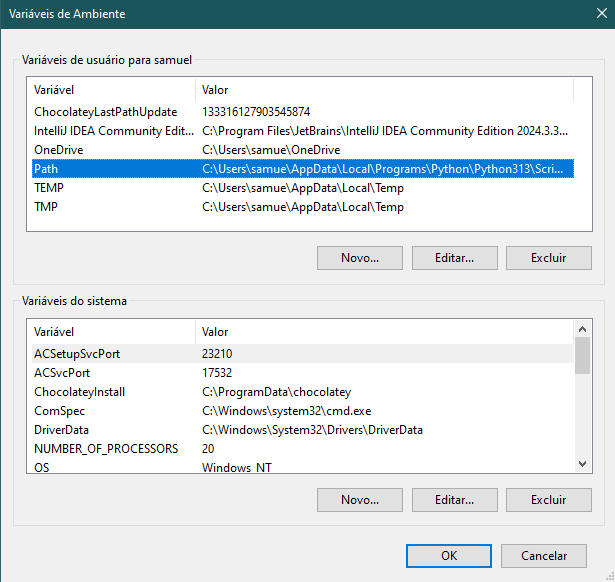
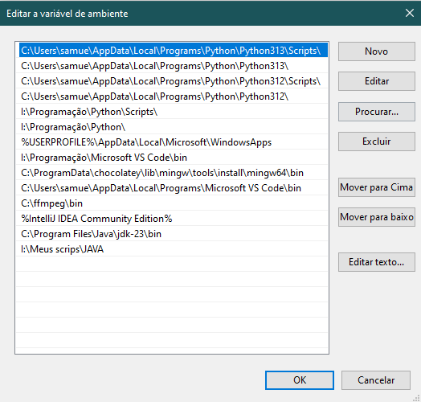
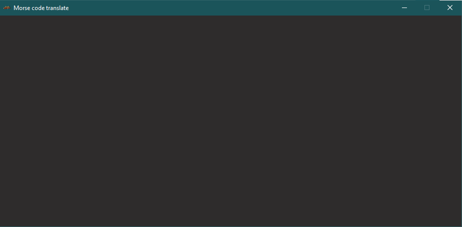
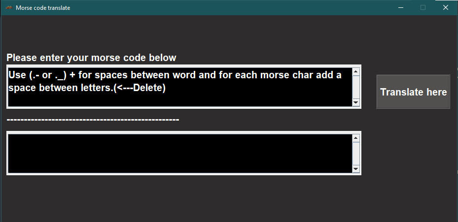

# Morse code translater
## Intro
I made this program to training my programing skills, I'm a computer scientist studant. 
The porposual of this program is to translate morse code made by *Samuel Morse* 

## Pre - requeriments
This app was made on Java **23.0.2** version.
Need JDK or JRE superior version to run, follow the link bellow 
https://www.oracle.com/java/technologies/downloads/

## Instruction to run
### Windows
If you want to run on windows using the executable download the Java and add the PATH 
Start >  gear(configuration) > System > left side scroll to about > System advance configuration > Enviroment Variable

EDIT >

New.

The usual path is C:\Program Files\Java\jdk-24\bin

or just run the MorseApp.jar

### Linux and Mac OS
Just run the MorseApp.jar

## To do
There is a bug when you run. When the program opens will show a invisible frame

minimaze and maximaze to fix

